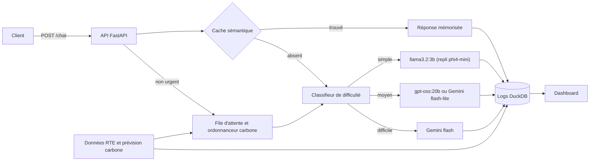

# GreenRoute · Architecture

## Schéma global

```mermaid
flowchart LR
  C["Client"] -->|"POST /chat"| A["API FastAPI"]
  A --> K{"Cache sémantique"}
  K -->|"trouvé"| R["Réponse mémorisée"]
  K -->|"absent"| D["Classifieur de difficulté"]
  A -->|"non urgent"| Q["File d'attente et ordonnanceur carbone"]
  Q --> D
  D -->|"simple"| S["llama3.2:3b (repli phi4-mini)"]
  D -->|"moyen"| M["gpt-oss:20b ou Gemini flash-lite"]
  D -->|"difficile"| G["Gemini flash"]
  S --> L[("Logs DuckDB")]
  M --> L
  G --> L
  R --> L
  RTE["Données RTE et prévision carbone"] --> Q
  RTE --> L
  L --> T["Dashboard"]
```